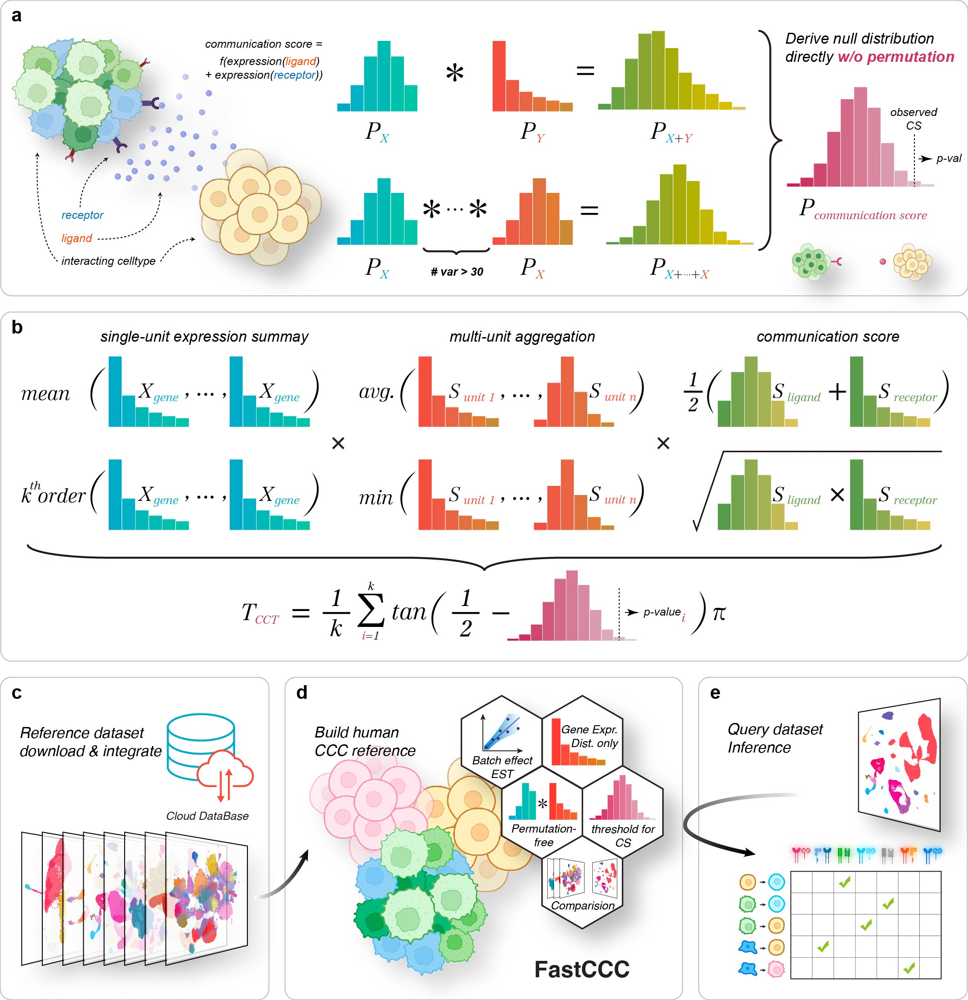

# FastCCC: A permutation-free framework for scalable, robust, and reference-based cell-cell communication analysis in single cell transcriptomics studies.
## Overview

 Detecting cell-cell communications (CCCs) in single-cell transcriptomics studies is fundamental for understanding the function of multicellular organisms. Here, we introduce FastCCC, a permutation-free framework that enables scalable, robust, and reference-based analysis for identifying critical CCCs and uncovering biological insights. FastCCC relies on fast Fourier transformation-based convolution to compute $p$-values analytically without permutations, introduces a modular algebraic operation framework to capture a broad spectrum of CCC patterns, and can leverage atlas-scale single cell references to enhance CCC analysis on user-collected datasets. To support routine reference-based CCC analysis, we constructed the first human CCC reference panel, encompassing 19 distinct tissue types, over 450 unique cell types, and approximately 16 million cells. We demonstrate the advantages of FastCCC across multiple datasets, most of which exceed the analytical capabilities of existing CCC methods. In real datasets, FastCCC reliably captures biologically meaningful CCCs, even in highly complex tissue environments, including differential interactions between endothelial and immune cells linked to COVID-19 severity, dynamic communications in thymic tissue during T-cell development, as well as distinct interactions in reference-based CCC analysis.  

## Installation

## How to use `FasstCCC`

## Citing the work
If you find the `FastCCC` package or any of the source code in this repository useful for your work, please cite:

> Hou, S., Ma, W., Zhou, X. FastCCC: A permutation-free framework 
> for scalable, robust, and reference-based cell-cell communication analysis 
> in single cell transcriptomics studies.

Visit our [group website](https://xiangzhou.github.io/) for more statistical 
tools on analyzing genetics, genomics and transcriptomics data.