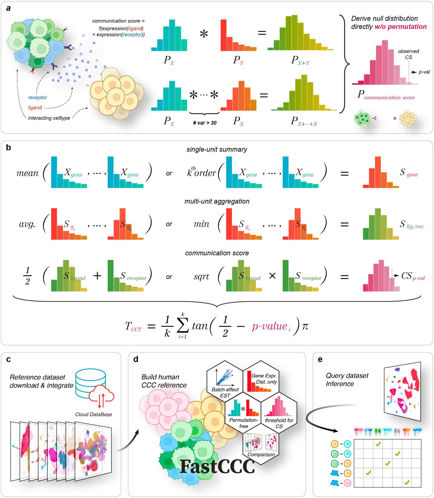

# FastCCC: A permutation-free framework for scalable, robust, and reference-based cell-cell communication analysis in single cell transcriptomics studies.


[](https://doi.org/10.1038/s41467-025-66272-z) &nbsp;
[](https://svvord.github.io/FastCCC/) &nbsp;
[](https://github.com/Svvord/FastCCC/blob/main/LICENSE)

**[2026.05.22]** Release: FastCCC v1.0.0 is now available. This release fixes several potential bugs, adds coding-agent skills for natural-language FastCCC workflows, and improves automated reports with cell-type-specific evidence explorers, clearer condition-comparison language, figure-generation audit records, and enhanced reference reports. Reference reports can be generated from a selected healthy tissue panel (`reference_tissue`) or from a user-built custom control panel (`reference_path`) with `fastccc.report.generate_reference_report`.

**[2026.05.09]** New: FastCCC now provides an automated HTML report generation feature (`fastccc.report.generate_report`). After running FastCCC, a single function call produces a self-contained interactive report covering global CCC overview, ligand-receptor analysis, pathway enrichment, cell-type profiles, network analyses, and, when two conditions are provided, a condition-comparison tab. See the [Report Tutorial](https://svvord.github.io/FastCCC/usage/report.html) for details.

**[2025.02.01]** Update: To minimize the size of transmitted panel data, we leverage FastCCC’s speed to compute essential reference data during first-time usage. This process incurs only an additional 1–2 minutes during initial activation. Meanwhile, the storage requirement for uploading the panel data has been significantly reduced (from 3GB to 5MB per tissue panel).

**[2025.01.23]** We have provided a comprehensive [tutorial](https://svvord.github.io/FastCCC/) on the usage of FastCCC, which includes detailed instructions on installation, usage, and more. We highly recommend referring to this [tutorial](https://svvord.github.io/FastCCC/) for a step-by-step guide.

## Coding-agent workflows

FastCCC includes project instructions for coding agents. In Codex or Claude Code, use
`$fastccc-agent`, for example:

```text
$fastccc-agent Run a standard FastCCC analysis for ./data/sample.h5ad. The cell type column is cell_type, and outputs should be saved under ./results/sample.
```

```text
$fastccc-agent Run a two-condition FastCCC comparison for ./data/cohort.h5ad. The condition column is treatment, compare treated vs control, use cell_type as the cell type column, and save outputs under ./results/treated_vs_control.
```

```text
$fastccc-agent Analyze ./data/query.h5ad with the healthy liver reference panel. The cell type column is cell_type, and outputs should be saved under ./results/query_vs_healthy_liver.
```

```text
$fastccc-agent Run reference-based analysis for ./data/cohort.h5ad. Use condition=control to build a custom reference, compare condition=disease as the query, and use cell_type as the cell type column.
```

## Overview

<p align="justify"> Detecting cell-cell communications (CCCs) in single-cell transcriptomics studies is fundamental for understanding the function of multicellular organisms. Here, we introduce FastCCC, a permutation-free framework that enables scalable, robust, and reference-based analysis for identifying critical CCCs and uncovering biological insights. FastCCC relies on fast Fourier transformation-based convolution to compute $p$-values analytically without permutations, introduces a modular algebraic operation framework to capture a broad spectrum of CCC patterns, and can leverage atlas-scale single cell references to enhance CCC analysis on user-collected datasets. To support routine reference-based CCC analysis, we constructed the first human CCC reference panel, encompassing 19 distinct tissue types, over 450 unique cell types, and approximately 16 million cells. We demonstrate the advantages of FastCCC across multiple datasets, most of which exceed the analytical capabilities of existing CCC methods. In real datasets, FastCCC reliably captures biologically meaningful CCCs, even in highly complex tissue environments, including differential interactions between endothelial and immune cells linked to COVID-19 severity, dynamic communications in thymic tissue during T-cell development, as well as distinct interactions in reference-based CCC analysis.  </p>

## Installation
### Method 1: Installing via conda
You can install the environment using Conda by following the steps:
```bash
conda create -n FastCCC python=3.11
conda activate FastCCC
```
Get FastCCC from github:
```bash
git clone https://github.com/Svvord/FastCCC.git
```
Go to the folder `FastCCC` and install:
```bash
cd ./FastCCC
pip install -e .
```

### Method 2: Installing via pip
```bash
pip install fastccc
```

### Method 3: Installing developing version via Poetry
For developing, we are using the [Poetry](https://python-poetry.org/) package manager. To install Poetry, follow the instructions [here](https://python-poetry.org/docs/#installing-with-pipx).
```bash
git clone https://github.com/Svvord/FastCCC.git
cd ./FastCCC
poetry install
```

### Method 4: Installing developing version via uv
Alternatively, you can use [uv](https://docs.astral.sh/uv/) for a faster setup. To install uv, follow the instructions [here](https://docs.astral.sh/uv/getting-started/installation/).
```bash
git clone https://github.com/Svvord/FastCCC.git
cd ./FastCCC
uv sync
```
To also install development dependencies:
```bash
uv sync --group dev
```

## How to use `FastCCC`
Check our [vignettes](https://svvord.github.io/FastCCC/).

## Citing the work
If you find the `FastCCC` package or any of the source code in this repository useful for your work, please [cite](https://www.biorxiv.org/content/10.1101/2025.01.27.635115v1):

> Hou, S., Ma, W. & Zhou, X. FastCCC: a permutation-free framework for scalable, robust, and reference-based cell-cell communication analysis in single cell transcriptomics studies. Nat Commun 16, 11428 (2025). https://doi.org/10.1038/s41467-025-66272-z

```
@article{hou_fastccc_2025,
	title = {{FastCCC}: a permutation-free framework for scalable, robust, and reference-based cell-cell communication analysis in single cell transcriptomics studies},
	author = {Hou, Siyu and Ma, Wenjing and Zhou, Xiang},
	journal = {Nature Communications},
	volume = {16},
	year = {2025},
	eid = {11428},
	doi = {10.1038/s41467-025-66272-z},
	url = {https://www.nature.com/articles/s41467-025-66272-z}
}
```


Visit our [group website](https://xiangzhou.github.io/) for more statistical 
tools on analyzing genetics, genomics and transcriptomics data.
