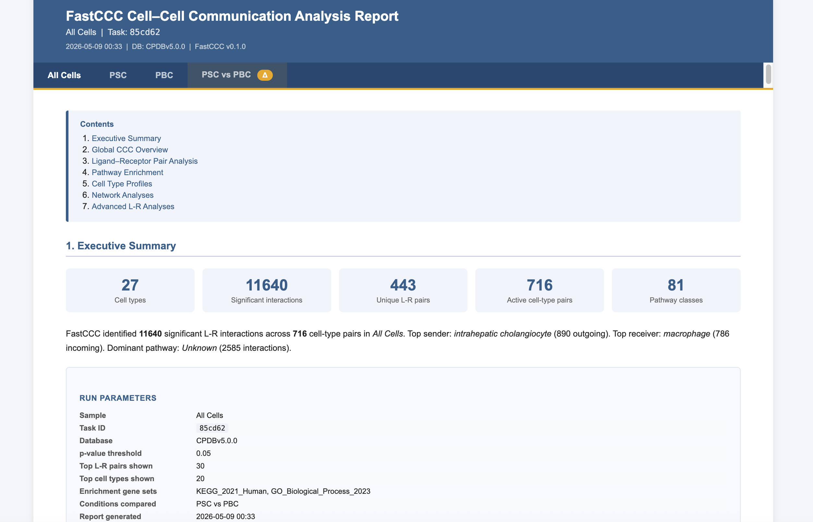
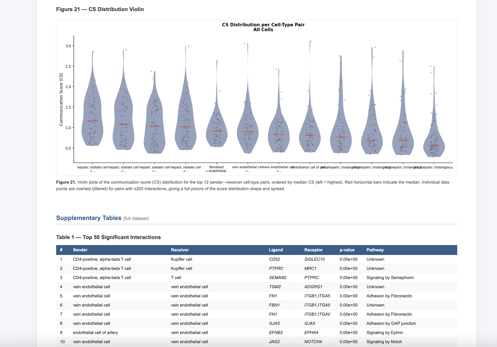
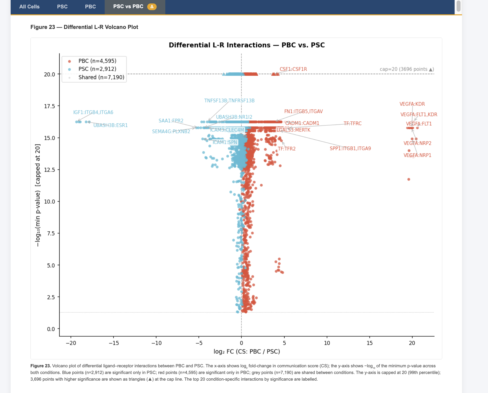

# FastCCC Examples

End-to-end scripts for running FastCCC and generating an automated HTML report.

| Script | Description |
|--------|-------------|
| [`report_single_condition.py`](report_single_condition.py) | Run FastCCC on one dataset and generate a report |
| [`report_multi_condition.py`](report_multi_condition.py) | Run FastCCC on a full dataset + two conditions in parallel, generate a report with differential analysis tab |

## Quick start

```bash
# single sample
python report_single_condition.py

# two conditions with differential analysis
python report_multi_condition.py
```

Edit the configuration block at the top of each script (file paths, condition column name, condition labels) before running.

## What the report looks like

**Executive Summary and run parameters**


**CS distribution violin plot and supplementary interaction table**


**Differential L-R volcano plot (two-condition comparison)**


## What the report contains

Each script produces a self-contained `report.html` that opens in any browser.  
The multi-condition report has four interactive tabs:

- **All Cells** — full dataset (21 figures)
- **Condition A** — condition-specific analysis (21 figures)
- **Condition B** — condition-specific analysis (21 figures)
- **Condition A vs Condition B** — differential interaction heatmap, volcano plot, pathway activity comparison

For the full parameter reference and more details, see the
[Report Tutorial](https://svvord.github.io/FastCCC/usage/report.html).
